# Secure 3-Tier Web Architecture on AWS

This is a project I built to practice designing and deploying a real-world cloud infrastructure on AWS. The idea was to set up a proper 3-tier architecture — web, application, and database — the way you'd actually do it in a production environment, with security and high availability in mind rather than just getting something running.

The setup uses a custom VPC with public and private subnets spread across two Availability Zones, a Bastion Host for secure access, Apache and PHP on the app servers, and a managed MySQL database through RDS. Traffic comes in through an Application Load Balancer and never touches the app or database servers directly.

---

## What the Architecture Looks Like

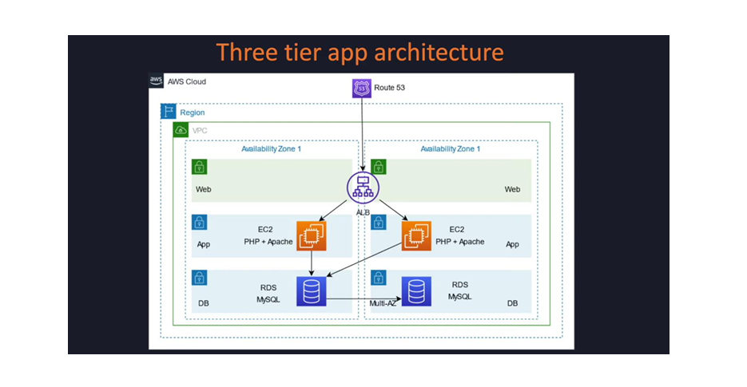

At a high level, requests come in from the internet, hit Route 53, then go to the Application Load Balancer which splits traffic between two EC2 app servers sitting in private subnets. Those app servers talk to an RDS MySQL database that has no public access at all. The only way to directly access any of the backend servers is through the Bastion Host (jump server) in the public subnet.
Internet → Route 53 → Application Load Balancer
↓
EC2 App Servers (PHP + Apache) — private subnets
↓
RDS MySQL — isolated DB subnets

---

## AWS Services I Used

| Service | What it's doing here |
|---|---|
| VPC | Custom network with CIDR `20.0.0.0/16` — everything lives inside this |
| EC2 (t3.micro) | Two app servers in private subnets + one Bastion Host in public subnet |
| Application Load Balancer | Distributes incoming traffic across both app servers |
| Amazon RDS MySQL | Managed database, completely private, no public endpoint |
| NAT Gateway | Lets private EC2 instances reach the internet for package installs |
| Internet Gateway | Handles inbound/outbound traffic for the public subnets |
| Security Groups | Different rules per tier so nothing talks to something it shouldn't |
| IAM | Roles and policies for least-privilege access |
| CloudWatch | Monitoring alarms on CPU and instance health |

---

## Network Setup

I created 6 subnets across two Availability Zones — two public ones for the web/load balancer tier, two private ones for the app servers, and two more isolated ones just for the database. Keeping them separated means a problem in one tier can't directly reach another.

| Subnet | Type | CIDR | AZ |
|---|---|---|---|
| web-pub-sub1 | Public | 20.0.1.0/24 | us-east-1a |
| web-pub-sub2 | Public | 20.0.2.0/24 | us-east-1b |
| app-pvt-sub1 | Private | 20.0.3.0/24 | us-east-1a |
| app-pvt-sub2 | Private | 20.0.4.0/24 | us-east-1b |
| db-pvt-sub1 | Private | 20.0.5.0/24 | us-east-1a |
| db-pvt-sub2 | Private | 20.0.6.0/24 | us-east-1b |

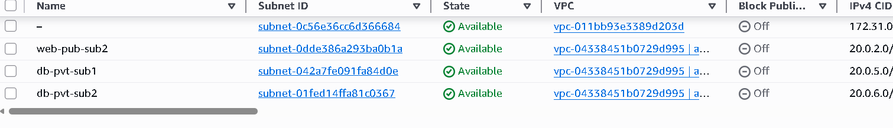
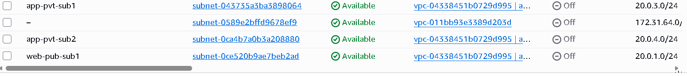

### Route Tables

Each tier gets its own route table so traffic is controlled properly. The web tier routes through the Internet Gateway, the app tier goes out through the NAT Gateway, and the DB tier has no internet route at all.

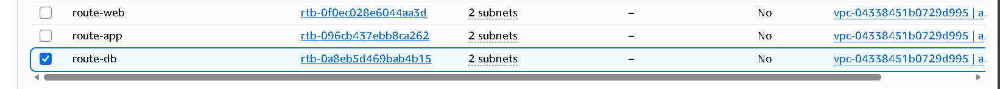

| Route Table | Subnets | Internet |
|---|---|---|
| route-web | web-pub-sub1, web-pub-sub2 | Internet Gateway |
| route-app | app-pvt-sub1, app-pvt-sub2 | NAT Gateway (outbound only) |
| route-db | db-pvt-sub1, db-pvt-sub2 | None |

### Internet Gateway

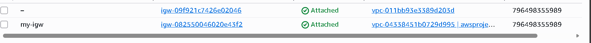

### NAT Gateway

The NAT Gateway sits in the public subnet and gives the private EC2 instances a way to reach the internet for things like installing packages, without exposing them publicly.

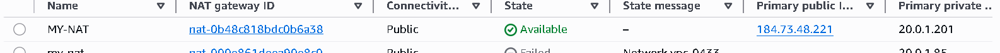

---

## EC2 Instances

I launched three instances — one Bastion Host in the public subnet and two app servers in separate private subnets across different AZs for redundancy. None of the app servers have a public IP.

| Instance | Role | Subnet | AZ |
|---|---|---|---|
| jump server | Bastion Host | web-pub-sub1 | us-east-1a |
| app-server1 | Application Server | app-pvt-sub1 | us-east-1a |
| app-server2 | Application Server | app-pvt-sub2 | us-east-1b |

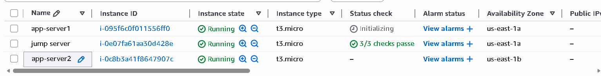

---

## Getting Into the Private Servers

Since the app servers have no public IP, you have to go through the Bastion Host to reach them. I copied the key over to the Bastion and SSH'd from there into the private instances.

```bash
# First, connect to the Bastion Host
ssh -i "projectkey.pem" ec2-user@<bastion-public-ip>

# Then from the Bastion, jump into the app server
chmod 400 projectkey.pem
ssh -i "projectkey.pem" ec2-user@20.0.3.60
```

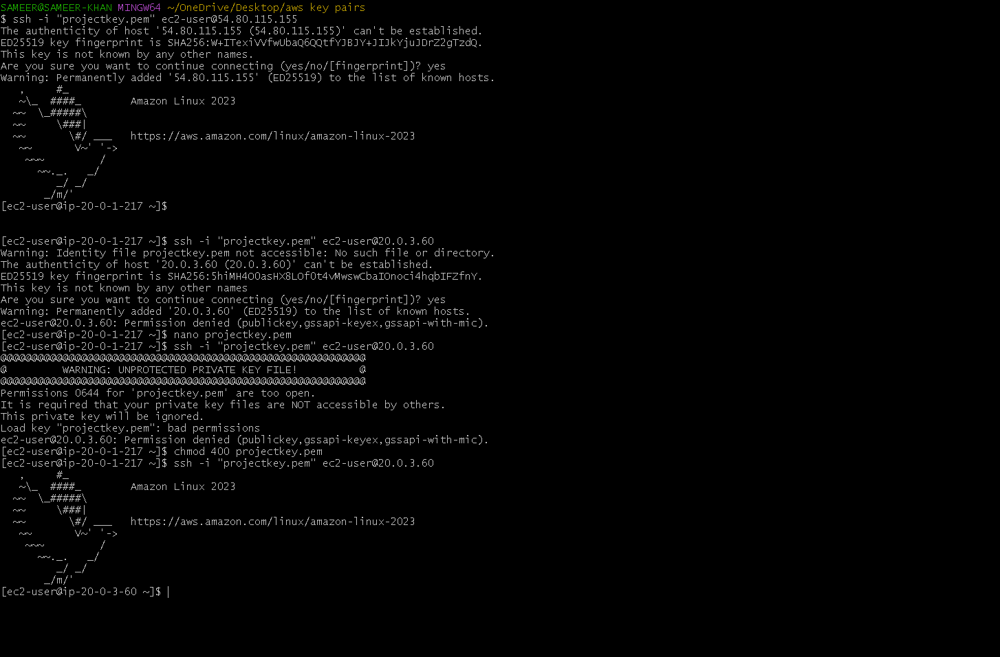

---

## Setting Up the App Servers

### Apache

Once inside the app server, I installed and enabled Apache so it starts automatically on reboot.

```bash
sudo yum install -y httpd
sudo systemctl start httpd
sudo systemctl enable httpd
sudo systemctl is-enabled httpd
```

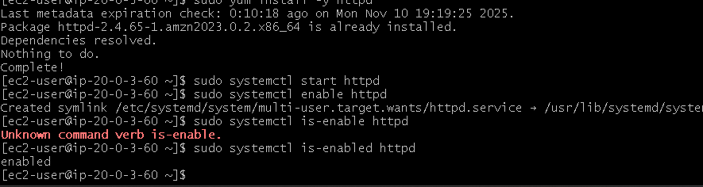

### PHP 8.2

Then PHP along with the MySQL connector so the app servers can talk to RDS.

```bash
sudo yum update -y
sudo dnf install php8.2
sudo dnf install php8.2-mysqlnd
```

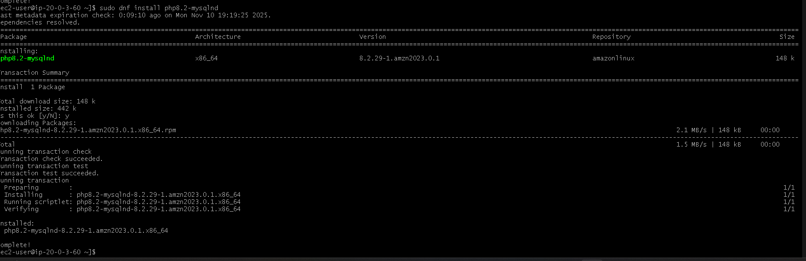

### phpMyAdmin

I also set up phpMyAdmin to make it easier to manage the database through a browser rather than the command line.

```bash
sudo systemctl restart httpd
sudo systemctl restart php-fpm
cd /var/www/html
wget https://www.phpmyadmin.net/downloads/phpMyAdmin-latest-all-languages.tar.gz
```

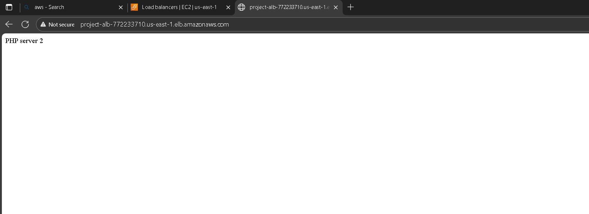
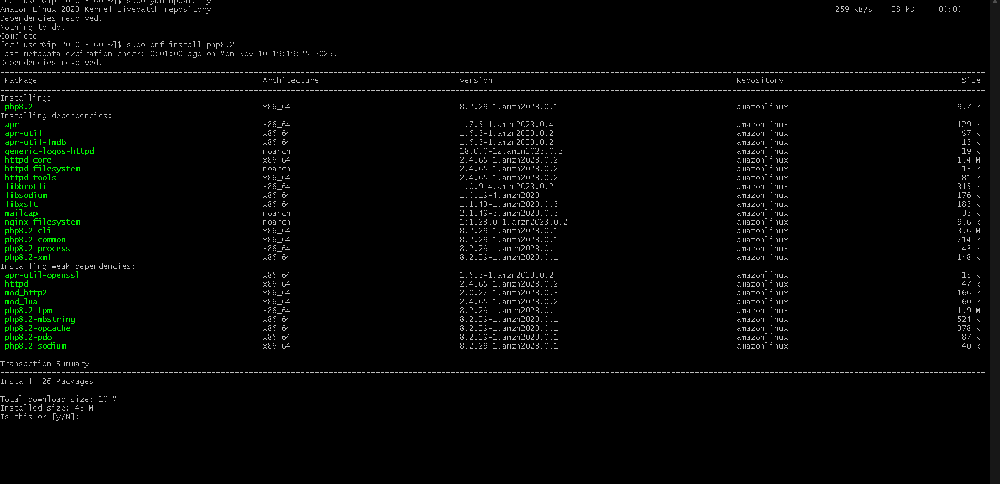
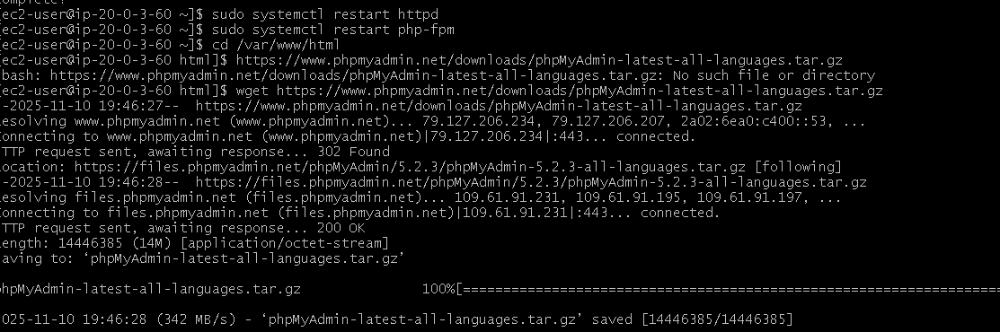

### phpMyAdmin Running Through the Load Balancer

After everything was set up, I could reach phpMyAdmin through the ALB's DNS — which confirmed the full stack was working together correctly.


Logged in and connected directly to the RDS instance:


The dashboard confirms the connection details — MySQL 8.0.35 running on the RDS endpoint, PHP 8.2.18, Apache 2.4.59 on Amazon Linux, all working together.

---

## Application Load Balancer

The ALB sits in the public subnets and forwards HTTP traffic on port 80 to both app servers through a target group called `app-tg`. I tested it by hitting the ALB DNS URL a few times and confirmed it was routing to both servers.

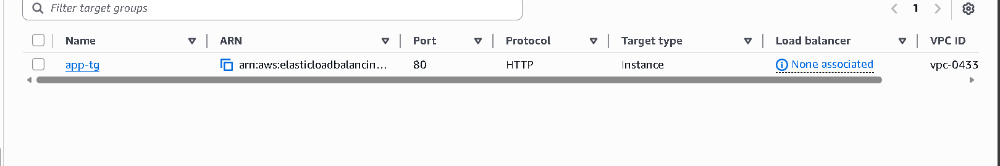

Hitting the ALB URL in the browser returned "PHP server 2" which confirmed the load balancer was working and reaching the private app servers successfully.

---

## RDS MySQL Database

The database runs on Amazon RDS in the private DB subnets with no public endpoint. The only thing allowed to connect to it is the app-tier security group.

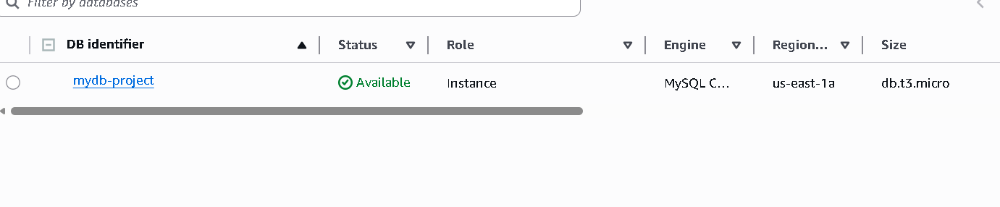

| Setting | Value |
|---|---|
| Identifier | mydb-project |
| Engine | MySQL 8.0.35 |
| Instance class | db.t3.micro |
| Region | us-east-1a |
| Public access | Disabled |

---

## Security

Security was one of the main goals of this project. The idea was that each tier can only talk to what it needs to, and nothing is exposed that doesn't have to be.
Internet
│
▼
ALB Security Group  —  allows HTTP/HTTPS from anywhere
│
▼
App Server Security Group  —  only accepts traffic from the ALB
│                           SSH only from Bastion Host
▼
DB Security Group  —  MySQL port 3306 open to app tier only

The Bastion Host is the only EC2 instance with a public IP. Everything else is locked inside private subnets.

---

## How I Built It (Step by Step)

1. Created a custom VPC with CIDR `20.0.0.0/16`
2. Created 6 subnets across 2 AZs — 2 public, 2 private app, 2 private DB
3. Attached an Internet Gateway and set up the public route table
4. Launched a NAT Gateway and pointed the private app route table to it
5. Set up Security Groups for each tier with the right inbound/outbound rules
6. Launched the Bastion Host in the public subnet and both app servers in private subnets
7. SSH'd into the app servers through the Bastion and installed Apache + PHP
8. Downloaded and configured phpMyAdmin on both app servers
9. Created an Application Load Balancer with a target group pointing to both app servers
10. Launched RDS MySQL in the DB private subnets with Multi-AZ option
11. Connected phpMyAdmin to RDS and verified the connection worked
12. Set up CloudWatch alarms for CPU usage and instance health

---

## Tech Stack

- Cloud: AWS
- OS: Amazon Linux 2023
- Web server: Apache (httpd)
- Backend: PHP 8.2
- Database: MySQL via Amazon RDS
- DB UI: phpMyAdmin
- Scripting: Bash

---

## Author

**Sameer Ali Khan** — Cloud & DevOps Enthusiast

[](mailto:sameeralikhan2160@gmail.com)
[](https://linkedin.com/in/sameer-khan-9a6603249)
[](https://github.com/sameeralikhan2160-byte)
